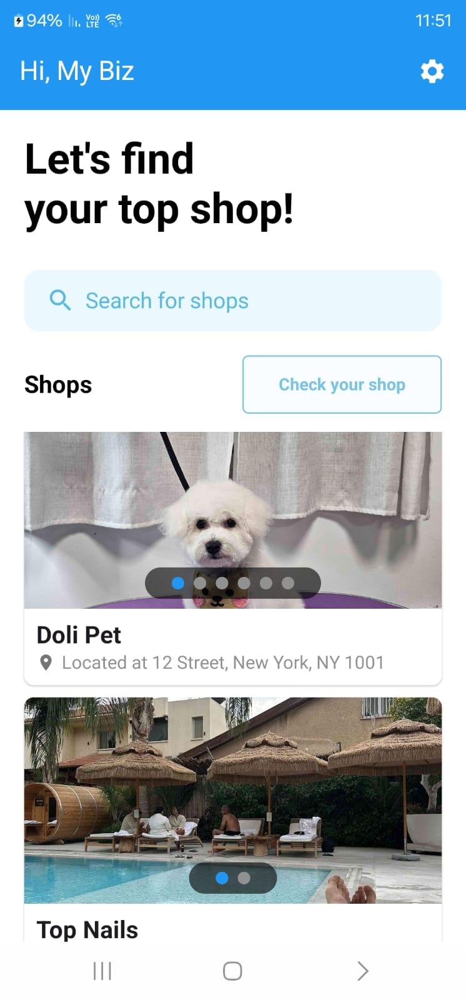
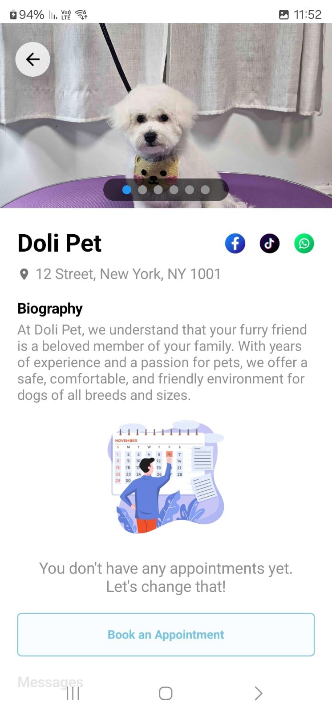
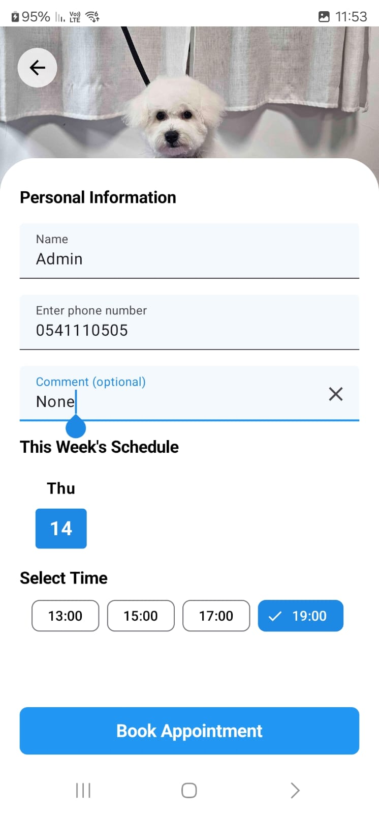

# My Biz

### About
MyBiz is a mobile application designed to streamline the process of booking appointments and 
managing business profiles, especially for small and independent business owners. 
The app provides an efficient, user-friendly platform that connects service providers 
with their clients, enabling seamless communication and scheduling.
<a href="https://play.google.com/store/apps/details?id=my.biz.app&pli=1" target="_blank">
<button>Download MyBiz From Google Play</button>
</a>

### 
 

  
  
  

### Key Features
**Authentication:** Users can securely sign up and log in to the app, ensuring that their 
personal and business data is protected.

**Appointment Booking:** Clients can easily set appointments with various businesses or shops created 
by other users. The intuitive interface simplifies the scheduling process for both clients and business owners.

**Business Creation and Management:** Users can create and manage their shops, allowing clients to 
set appointments. Business owners can add essential information such as business name, address, 
bio, business type (e.g., pet grooming), images, and social media links (Facebook, TikTok, WhatsApp).

**Admin Panel for Shop Owners:** Shop owners have access to an admin panel to manage their business 
efficiently. They can view and handle client appointments, update shop details, and monitor the 
overall performance of their business.

**Push Notifications:** Business owners receive real-time push notifications when clients set
appointments or make updates, helping them stay on top of their scheduling and never miss 
important bookings.

**Change App Language:** Users can customize the app language according to their preference, making 
MyBiz accessible and user-friendly for a global audience.

**Profile and Business Customization:** Users can update their personal and business information at 
any time, ensuring that details remain accurate and relevant.

**Data Privacy and Security:** The app collects only essential information, and users have full control 
over their data. An easy account deletion feature permanently removes all user data from the system.

### Technologies
* **Jetpack Compose:** Modern declarative UI framework.
* **Ktor:** Server-side framework for push notification handling.
* **Coil:** Efficient image loading library.
* **Firebase:** Comprehensive backend and remote database solution.
* **Retrofit:** HTTP client for network requests.
* **MVVM:** Clean, maintainable app architecture.
* **Dagger Hilt:** Dependency injection framework.
* **Room:** Local data caching with SQLite.
